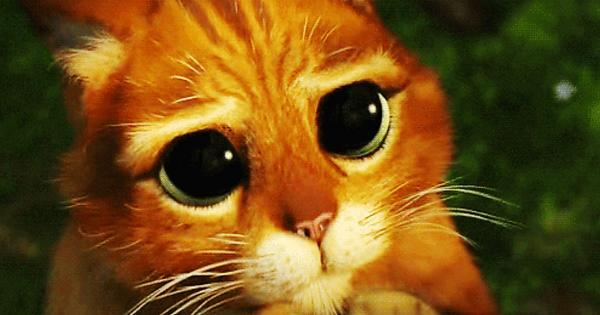
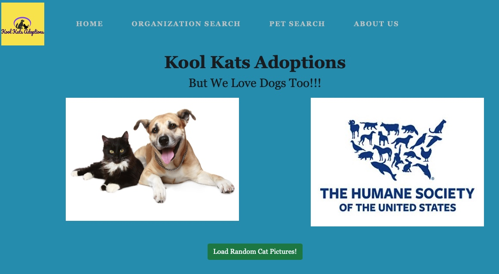
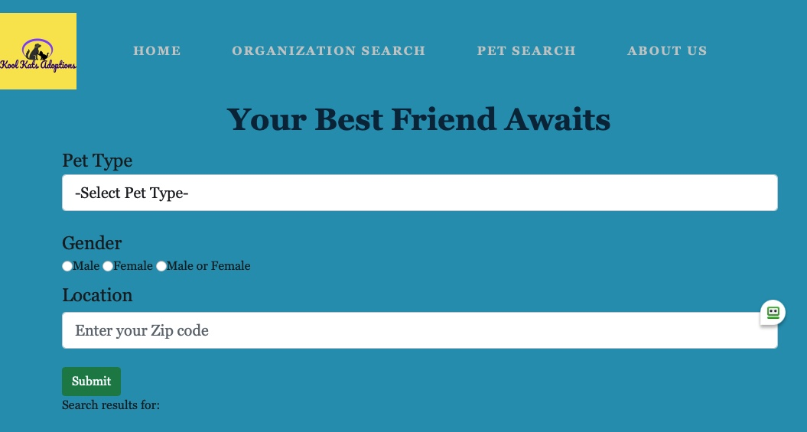
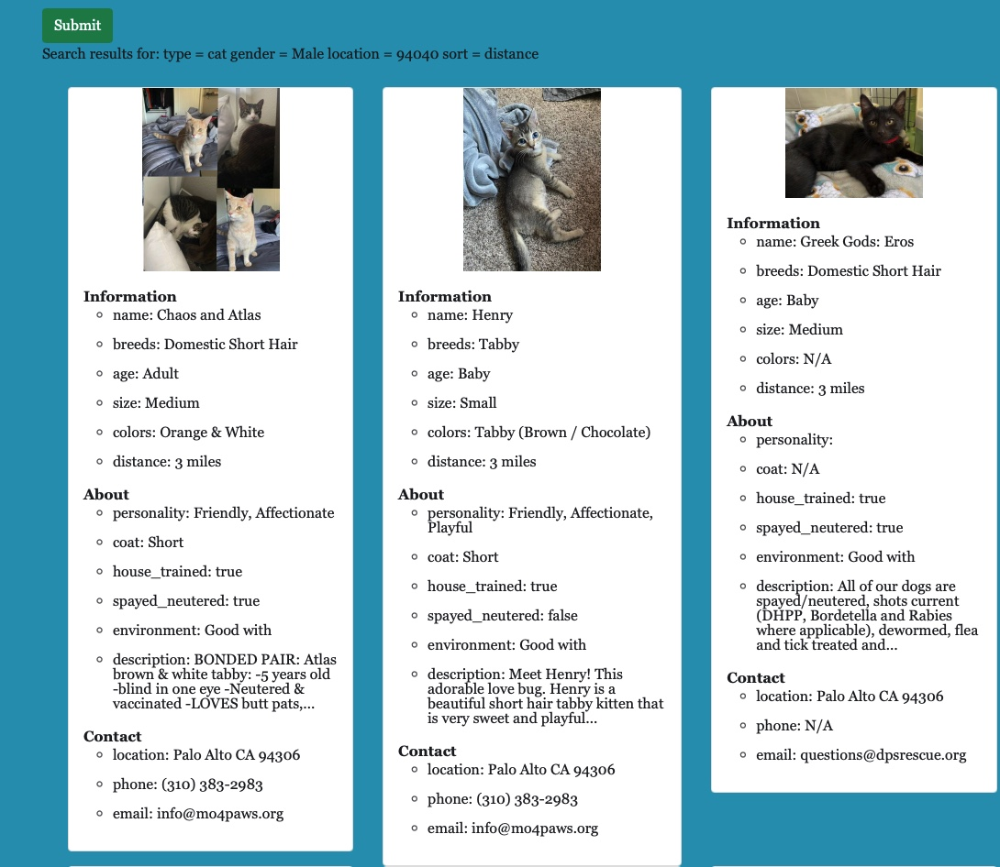

# Cool Cats Adoption!
## Yes you can adopt dogs too!

This is our first DigitalCrafts boot-camp group project.  This project is a front-end pet adoption app.  The app will provide the following features:
1) Home page will contain links that allow users to search by type of pet or organization.
2) Type of pet page will have form information that will narrow down search and return results.
3) Organization page will give a list of facilities within location criteria.
4) A pet adoption form will be available via link.

### Technologies

1) AJAX (API calls) with Node Fetch
2) Bootstrap (CSS)
3) JQuery UI
4) HTML
5) JavaScript

### API

1) The Petfinder API - https://www.petfinder.com/developers/v2/docs/
2) The Cat Api - https://thecatapi.com
3) HTTP/JSON API

Deployment: Netlify
[www.KoolKatsAdoptions.com](www.KoolKatsAdoptions.com)

### Screen Shots
Main Home page

Pet Search

Pet Search Results

### Team Members

- Scott Henderson 
- Justin Geho 
- Teyon Price 
- Charles Eldridge
